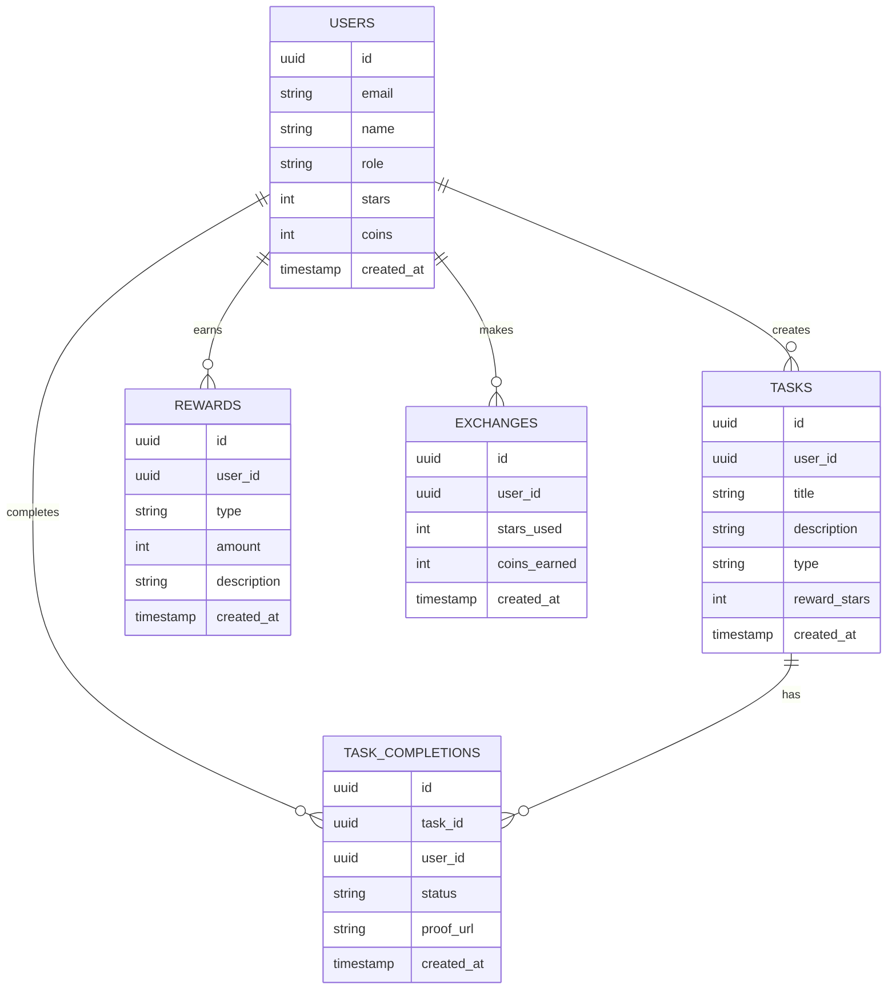

# 小学生作业与生活小程序 技术架构

## 1. Architecture Design
```mermaid
graph TB
    Frontend[React 前端] --&gt; Supabase[Supabase 后端]
    Supabase --&gt; Database[(PostgreSQL 数据库)]
    Supabase --&gt; Auth[认证服务]
    Supabase --&gt; Storage[存储服务]
```

## 2. Technology Description
- 前端：React@18 + tailwindcss@3 + vite
- 初始化工具：vite-init
- 后端：Supabase
- 数据库：Supabase (PostgreSQL)

## 3. Route Definitions
| Route | Purpose |
|-------|---------|
| / | 首页 - 任务列表、余额展示 |
| /tasks | 任务中心 - 任务列表和详情 |
| /rewards | 奖励商城 - 星星兑换金币 |
| /games | 游戏中心 - 小游戏列表和游玩 |
| /profile | 个人中心 - 成长记录和设置 |

## 4. API Definitions
使用 Supabase 客户端 SDK，无需额外后端 API

## 5. Server Architecture Diagram
不适用，使用 Supabase 作为后端服务

## 6. Data Model
### 6.1 Data Model Definition


### 6.2 Data Definition Language
```sql
-- 用户表
create table users (
    id uuid primary key default auth.uid() not null,
    email text unique,
    name text,
    role text default 'child',
    stars int default 0,
    coins int default 0,
    created_at timestamp with time zone default timezone('utc'::text, now()) not null
);

alter table users enable row level security;

create policy "Users can view their own data" on users
    for select using (auth.uid() = id);

create policy "Users can update their own data" on users
    for update using (auth.uid() = id);

-- 任务表
create table tasks (
    id uuid primary key default gen_random_uuid() not null,
    user_id uuid references auth.uid(),
    title text not null,
    description text,
    type text not null,
    reward_stars int default 1,
    created_at timestamp with time zone default timezone('utc'::text, now()) not null
);

alter table tasks enable row level security;

create policy "Anyone can view tasks" on tasks
    for select using (true);

create policy "Parents can create tasks" on tasks
    for insert with check (auth.uid() = user_id);

-- 任务完成记录表
create table task_completions (
    id uuid primary key default gen_random_uuid() not null,
    task_id uuid references tasks(id),
    user_id uuid references auth.uid(),
    status text default 'pending',
    proof_url text,
    created_at timestamp with time zone default timezone('utc'::text, now()) not null
);

alter table task_completions enable row level security;

create policy "Users can view their completions" on task_completions
    for select using (auth.uid() = user_id);

create policy "Users can create completions" on task_completions
    for insert with check (auth.uid() = user_id);

-- 奖励记录表
create table rewards (
    id uuid primary key default gen_random_uuid() not null,
    user_id uuid references auth.uid(),
    type text not null,
    amount int not null,
    description text,
    created_at timestamp with time zone default timezone('utc'::text, now()) not null
);

alter table rewards enable row level security;

create policy "Users can view their rewards" on rewards
    for select using (auth.uid() = user_id);

-- 兑换记录表
create table exchanges (
    id uuid primary key default gen_random_uuid() not null,
    user_id uuid references auth.uid(),
    stars_used int not null,
    coins_earned int not null,
    created_at timestamp with time zone default timezone('utc'::text, now()) not null
);

alter table exchanges enable row level security;

create policy "Users can view their exchanges" on exchanges
    for select using (auth.uid() = user_id);
```
