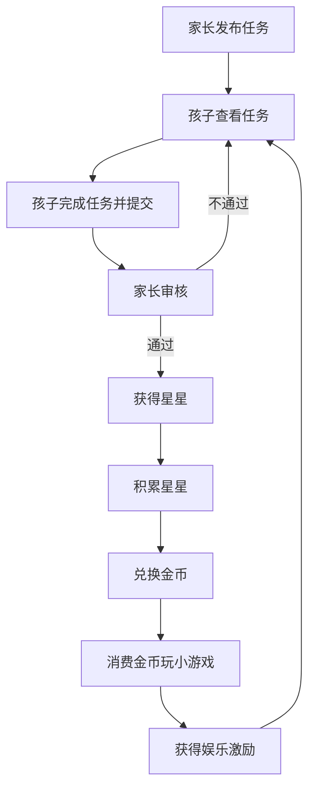

# 小学生作业与生活小程序 PRD

## 1. Product Overview
这是一个面向小学生的任务奖励系统，通过完成作业、家务和生活表现获得奖励，培养良好习惯并提供娱乐激励。
- 目标用户：小学生及其家长
- 核心价值：通过游戏化机制激励孩子养成良好学习和生活习惯

## 2. Core Features

### 2.1 User Roles
| Role | Registration Method | Core Permissions |
|------|---------------------|------------------|
| 家长 | 手机号/微信注册 | 发布任务、审核任务、管理奖励设置 |
| 孩子 | 家长邀请加入 | 查看任务、完成任务、领取奖励、玩小游戏 |

### 2.2 Feature Module
1. **首页**：任务列表、星星/金币余额展示、快捷操作
2. **任务中心**：作业任务、家务任务、生活表现任务
3. **奖励商城**：星星兑换金币、查看兑换记录
4. **游戏中心**：小游戏列表、金币消费、游戏游玩
5. **个人中心**：成长记录、设置、数据统计

### 2.3 Page Details
| Page Name | Module Name | Feature description |
|-----------|-------------|---------------------|
| 首页 | 余额展示 | 实时显示当前星星数和金币数 |
| 首页 | 快捷任务 | 快速添加/完成日常任务 |
| 首页 | 成就展示 | 近期获得的成就和奖励 |
| 任务中心 | 任务列表 | 按类型分类展示可完成的任务 |
| 任务中心 | 任务详情 | 查看任务要求、奖励、提交完成证明 |
| 奖励商城 | 兑换功能 | 星星按比例兑换金币 |
| 奖励商城 | 兑换记录 | 查看历史兑换记录 |
| 游戏中心 | 游戏列表 | 展示可玩的小游戏及所需金币 |
| 游戏中心 | 游戏游玩 | 点击开始游戏，消耗金币获得游玩时间 |
| 个人中心 | 成长记录 | 查看任务完成历史和奖励获得记录 |
| 个人中心 | 设置 | 家长端可设置兑换比例、任务模板等 |

## 3. Core Process
1. 家长发布任务 → 孩子查看并完成任务 → 家长审核通过 → 孩子获得星星
2. 孩子积累星星 → 在奖励商城兑换金币
3. 孩子用金币在游戏中心开启小游戏
4. 完成更多任务获得更多奖励，形成正向循环

## 4. User Interface Design
### 4.1 Design Style
- 主色调：明亮的天蓝色 (#4A90E2) 和温暖的橙色 (#F5A623)
- 辅助色：清新的绿色 (#7ED321) 和可爱的粉色 (#F8E71C)
- 按钮风格：圆角矩形，带有轻微阴影，点击有反馈动画
- 字体：圆润可爱的无衬线字体，标题大号加粗，正文清晰易读
- 布局风格：卡片式布局，内容分区清晰，适合儿童操作
- 图标风格：扁平化卡通风格，使用emoji增强趣味性

### 4.2 Page Design Overview
| Page Name | Module Name | UI Elements |
|-----------|-------------|-------------|
| 首页 | 余额展示 | 大数字显示，星星和金币图标，动画效果 |
| 首页 | 快捷任务 | 彩色卡片，大按钮，易于点击 |
| 任务中心 | 任务列表 | 分类标签，卡片式任务项，状态标识 |
| 奖励商城 | 兑换功能 | 大兑换按钮，比例说明，动画反馈 |
| 游戏中心 | 游戏列表 | 游戏封面图，所需金币标识，吸引力强 |

### 4.3 Responsiveness
- 移动端优先设计，适配手机和平板
- 触摸优化：大按钮、足够的点击区域
- 简洁直观的导航，适合儿童使用

### 4.4 小游戏建议
- 简单的拼图游戏
- 记忆配对游戏
- 数字加减法小游戏
- 颜色识别游戏
- 简单的迷宫游戏
