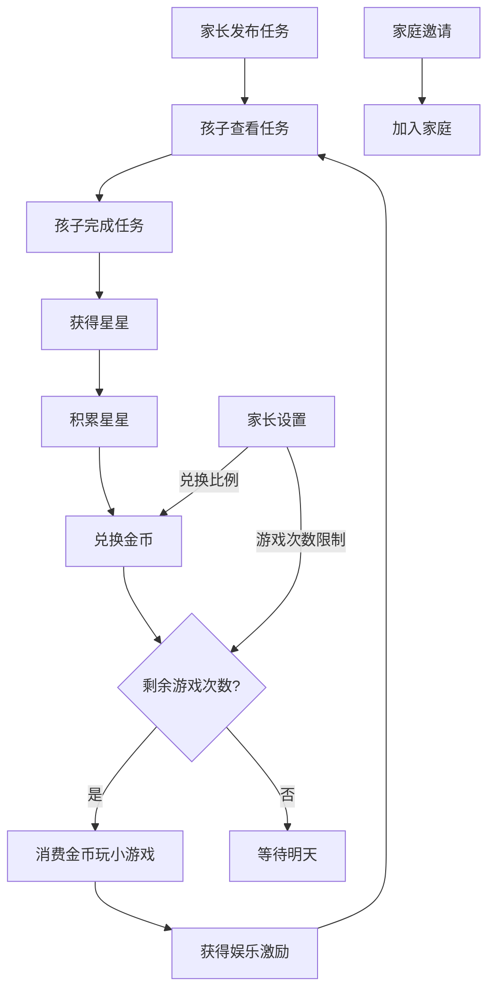

# 小学生作业与生活小程序 PRD

## 1. Product Overview
这是一个面向小学生的任务奖励系统，通过完成作业、家务和生活表现获得奖励，培养良好习惯并提供娱乐激励。
- 目标用户：小学生及其家长
- 核心价值：通过游戏化机制激励孩子养成良好学习和生活习惯
- 特色功能：角色权限分离、家庭管理、灵活的兑换设置

## 2. Core Features

### 2.1 User Roles
| Role | Registration Method | Core Permissions |
|------|---------------------|------------------|
| 家长 | 默认家长模式 | 发布任务、删除任务、管理奖励设置、设置游戏限制、家庭管理 |
| 孩子 | 默认小朋友模式 | 查看任务、完成任务、兑换金币、玩小游戏、查看个人记录 |

### 2.2 Feature Module
1. **首页**：任务列表、星星/金币余额展示、快捷操作、角色切换
2. **任务中心**：作业任务、家务任务、生活表现任务、按日期分组管理
3. **奖励商城**：星星兑换金币、查看兑换记录、家长设置兑换比例
4. **游戏中心**：小游戏列表、金币消费、游戏游玩、每日游戏次数限制
5. **个人中心**：成长记录、家长设置、家庭管理、数据统计

### 2.3 Page Details
| Page Name | Module Name | Feature description |
|-----------|-------------|---------------------|
| 首页 | 余额展示 | 实时显示当前星星数和金币数 |
| 首页 | 快捷任务 | 快速完成日常任务 |
| 首页 | 角色切换 | 一键切换家长/小朋友模式 |
| 首页 | 成就展示 | 近期获得的成就和奖励 |
| 任务中心 | 任务列表 | 按类型和日期分组展示任务 |
| 任务中心 | 任务排序 | 未完成任务优先，按时间倒序排列 |
| 任务中心 | 日期文件夹 | 按"今天"、"昨天"、具体日期分组 |
| 任务中心 | 家长权限 | 新增、删除任务（仅家长可见） |
| 奖励商城 | 兑换功能 | 星星按自定义比例兑换金币 |
| 奖励商城 | 兑换比例设置 | 家长设置1颗星星可兑换多少金币 |
| 奖励商城 | 兑换记录 | 查看历史兑换记录 |
| 游戏中心 | 游戏列表 | 展示可玩的小游戏及所需金币 |
| 游戏中心 | 游戏次数限制 | 每日游戏次数限制，显示剩余次数 |
| 游戏中心 | 游戏设置 | 家长设置每次消耗金币、每日次数、游戏时长 |
| 游戏中心 | 游戏游玩 | 点击开始游戏，消耗金币获得游玩时间 |
| 个人中心 | 成长记录 | 查看任务完成历史和游戏记录 |
| 个人中心 | 家长设置 | 游戏和兑换设置、家庭管理、数据重置 |
| 个人中心 | 家庭管理 | 生成家庭邀请码、加入家庭、添加成员 |

## 3. Core Process
1. 家长/孩子完成任务 → 获得星星奖励
2. 孩子积累星星 → 在奖励商城兑换金币（比例由家长设置）
3. 孩子用金币在游戏中心玩小游戏（每日次数限制）
4. 完成更多任务获得更多奖励，形成正向循环
5. 家长可管理任务、设置游戏限制、邀请家庭成员

## 4. User Interface Design
### 4.1 Design Style
- 主色调：明亮的天蓝色 (#4A90E2) 和温暖的橙色 (#F5A623)
- 辅助色：清新的绿色 (#7ED321) 和可爱的粉色 (#F8E71C)
- 按钮风格：圆角矩形，带有轻微阴影，点击有反馈动画
- 字体：圆润可爱的无衬线字体，标题大号加粗，正文清晰易读
- 布局风格：卡片式布局，内容分区清晰，适合儿童操作
- 图标风格：扁平化卡通风格，使用emoji增强趣味性

### 4.2 Page Design Overview
| Page Name | Module Name | UI Elements |
|-----------|-------------|-------------|
| 首页 | 余额展示 | 大数字显示，星星和金币图标，动画效果 |
| 首页 | 角色切换 | 顶部导航栏，家长/小朋友模式切换按钮 |
| 首页 | 快捷任务 | 彩色卡片，大按钮，易于点击 |
| 任务中心 | 日期分组 | 日期标题卡片，显示今日/昨日/历史任务 |
| 任务中心 | 任务列表 | 分类标签，卡片式任务项，状态标识 |
| 任务中心 | 家长操作 | 新增/删除按钮（仅家长可见） |
| 奖励商城 | 兑换功能 | 大兑换按钮，比例说明，动画反馈 |
| 奖励商城 | 比例设置 | 家长专用设置入口，滑块或数字输入 |
| 游戏中心 | 次数限制 | 进度条显示，今日已用/总次数 |
| 游戏中心 | 游戏列表 | 游戏封面图，所需金币标识，吸引力强 |
| 个人中心 | 家庭管理 | 邀请码生成，加入输入框，成员列表 |

### 4.3 Responsiveness
- 移动端优先设计，适配手机和平板
- 触摸优化：大按钮、足够的点击区域
- 简洁直观的导航，适合儿童使用

### 4.4 小游戏列表
- 🎯 **记忆配对**：翻牌配对，锻炼记忆力
- 🔢 **数学加法**：快速计算，提升算数能力
- 🎨 **颜色识别**：认识颜色，增强观察力

## 5. 权限控制设计
### 5.1 家长专属功能
- ✅ 新增任务
- ✅ 删除任务
- ✅ 设置兑换比例（0.5 - 10 金币/星）
- ✅ 设置游戏限制（每次消耗金币、每日次数、游戏时长）
- ✅ 家庭管理（生成邀请码、添加成员）
- ✅ 数据重置

### 5.2 小朋友权限
- ✅ 查看任务
- ✅ 完成任务
- ✅ 兑换金币
- ✅ 玩小游戏
- ✅ 查看个人记录
- ❌ 无法修改设置

## 6. 数据持久化
- 使用本地存储（localStorage）保存所有数据
- 状态管理使用Zustand + persist中间件
- 包括：任务列表、星星金币、兑换记录、游戏记录、家庭设置、成就
