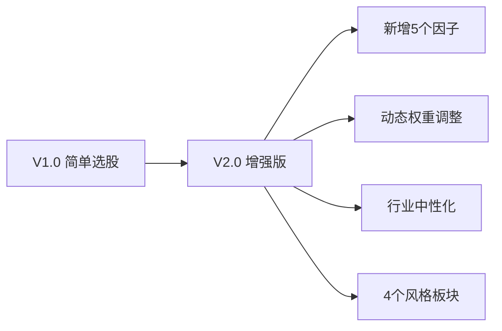
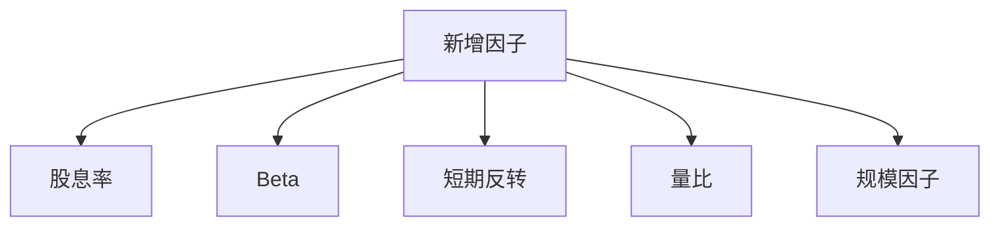
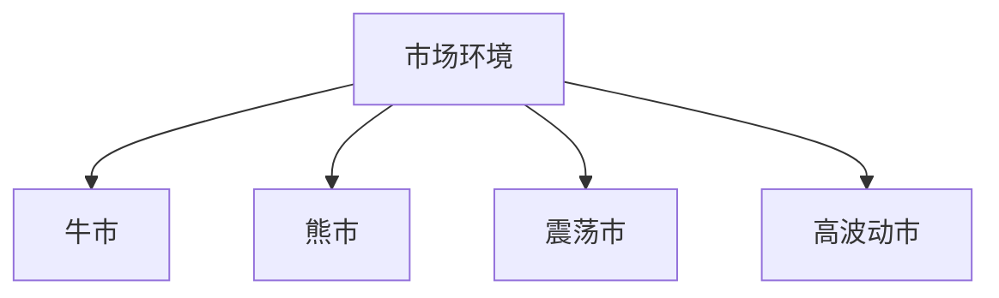

# 股票池选股器 V2.0 - 学习使用文档

> 基于东方财富掘金量化平台的增强版多因子选股策略

---

## 目录

1. [版本升级介绍](#版本升级介绍)
2. [快速开始](#快速开始)
3. [新增因子详解](#新增因子详解)
4. [动态权重调整](#动态权重调整)
5. [行业中性化处理](#行业中性化处理)
6. [完整配置说明](#完整配置说明)
7. [常见问题](#常见问题)

---

## 版本升级介绍

### V1.0 vs V2.0 对比

| 特性 | V1.0 | V2.0 |
|-----|------|------|
| **因子数量** | 9个 | 14个 |
| **新增因子** | - | 股息率、Beta、反转、量比、规模 |
| **动态权重** | ❌ | ✅ |
| **行业中性** | ❌ | ✅ |
| **行业分散** | 手动限制 | 自动平衡 |
| **板块池** | 3个 | 4个 |
| **选股数** | 20只 | 25只 |

### 升级亮点



---

## 快速开始

### 1. 文件准备

确保以下文件在同一目录：

```
.
├── stock_selector_v2.py              # 主程序代码
├── stock_selector_v2_config.json     # 配置文件
└── stock_selector_v2_doc.md          # 本文档
```

### 2. 配置Token

打开配置文件 `stock_selector_v2_config.json`，修改：

```json
{
  "backtest": {
    "token": "YOUR_TOKEN_HERE"  // 替换为你的掘金token
  }
}
```

### 3. 运行程序

#### 方式一：直接运行（推荐）

```bash
python stock_selector_v2.py
```

#### 方式二：调度模式

```bash
python stock_selector_v2.py --schedule
```

### 4. 查看输出

运行后会生成：

- `stock_selector_v2.log` - 详细运行日志
- `股票池V2_YYYYMMDD_HHMMSS.xlsx` - 选股结果Excel报告

---

## 新增因子详解

### 新增的5个因子



---

### 1. 股息率 (Dividend Yield)

#### 什么是股息率？

```
股息率 = 现金分红 / 股价 × 100%
```

#### 计算方式

```python
dividend_yield = dividend_per_share / price
```

#### 通俗理解

```
🏭 例子：

茅台每股分红25元
茅台股价1850元

股息率 = 25 / 1850 ≈ 1.35%

银行股每股分红0.3元
银行股价5元

股息率 = 0.3 / 5 = 6.0%
```

#### 使用场景

| 场景 | 评价 |
|-----|------|
| 股息率 > 4% | 高分红股票，适合长期持有 |
| 股息率 2%-4% | 中规中矩 |
| 股息率 < 2% | 要么不分红，要么股价太高 |

#### 熊市利器

```
熊市里大家都慌，怎么办？
股息率高的股票有"安全垫"
→ 就算股价不涨，每年拿4%分红也很香
```

---

### 2. Beta 系数 (贝塔系数)

#### 什么是Beta？

```
Beta = 股票涨跌 / 市场大盘涨跌
```

#### 计算方式

```python
# 计算股票收益率和大盘收益率的协方差除以大盘方差
stock_returns = ...
index_returns = ...
covariance = cov(stock_returns, index_returns)
index_variance = var(index_returns)
beta = covariance / index_variance
```

#### 通俗理解

```
假设大盘今天涨了1%

情况A：Beta = 1.5
→ 这股票涨1.5%（波动大）
→ 牛市涨得猛，熊市跌得也凶

情况B：Beta = 0.8
→ 这股票涨0.8%（波动小）
→ 牛市涨得慢，但熊市抗跌

情况C：Beta = 1.0
→ 涨跌跟大盘一样
→ 标准的"市场平均"
```

#### Beta分类

| Beta值 | 类型 | 适用场景 |
|--------|------|---------|
| < 0.8 | 低贝塔 | 防御策略、熊市 |
| 0.8-1.2 | 中贝塔 | 均衡、震荡市 |
| > 1.2 | 高贝塔 | 激进策略、牛市 |

#### V2.0使用

```python
# Beta得分：越接近1.0得分越高
beta_score = 1 - abs(stock['beta'] - 1.0)
```

---

### 3. 短期反转 (Short-term Reversal)

#### 什么是反转？

```
短期涨幅过大 → 容易回调
短期跌幅过大 → 容易反弹
```

#### 计算方式

```python
# 5日反转 = 5天前价格 / 今天价格 - 1
reversal_5d = (price_5days_ago / price_today) - 1
```

#### 通俗理解

```
📈 例子1：

这只股票连续5天暴涨20%
→ 短期涨幅太大，容易回调
→ 反转因子会给负分

📉 例子2：

这只股票连续5天暴跌15%
→ 短期跌幅太大，容易反弹
→ 反转因子会给正分
```

#### 适用场景

| 情况 | 反转策略 |
|-----|---------|
| 追涨已经涨很多的股票 | ❌ 避免 |
| 抄底已经跌很多的股票 | ✅ 可能 |

---

### 4. 量比 (Volume Ratio)

#### 什么是量比？

```
量比 = 最近5天平均成交量 / 最近20天平均成交量
```

#### 计算方式

```python
volume_avg_5 = avg(volume[-5:])
volume_avg_20 = avg(volume[-20:-5])
volume_ratio = volume_avg_5 / volume_avg_20
```

#### 通俗理解

```
📊 例子：

平时成交量每天1000万
最近5天突然每天2000万
量比 = 2.0
→ 说明有资金"异动"
→ 可能有人在偷偷建仓或出货
```

#### 量比判断

| 量比 | 评价 |
|-----|------|
| > 1.5 | 放量，可能有行情 |
| 0.8-1.5 | 正常，没什么事 |
| < 0.8 | 缩量，关注度低 |

---

### 5. 规模因子 (Size Factor)

#### 什么是规模因子？

```
规模因子 = -log(总市值)

逻辑：市值越小，越容易有弹性（前提是基本面没问题）
```

#### 通俗理解

```
🎯 例子：

A 公司：总市值100亿
→ log(100) = 4.6
→ 规模因子 = -4.6

B 公司：总市值5000亿
→ log(5000) = 8.5
→ 规模因子 = -8.5

在因子排名里：
A 得分会比 B 高
→ 中小盘相对大盘股有"溢价"
```

#### 注意

```
V2.0里规模因子权重只有0.02（2%）
因为我们已经有了市值筛选（>50亿）
这只是个微调项，不是主要因子
```

---

## 动态权重调整

### 为什么要动态调整？

```
❌ 静态权重问题：
→ 牛市和熊市用一样的配置
→ 结果：牛市赚不够，熊市亏太多

✅ 动态权重好处：
→ 牛市追动量，熊市求稳健
→ 不同市场环境用不同策略
```

### 四种市场环境



---

### 环境一：牛市

#### 判断标准

```python
# 过去30天平均日收益 > 0.3%
# 且成交量放大 > 10%
if avg_return > 0.003 and volume_trend > 0.1:
    return 'bull'
```

#### 权重调整

| 因子类 | 调整幅度 | 原因 |
|--------|---------|------|
| 动量因子 | × 1.4 | 牛市里强者恒强 |
| 估值因子 | × 0.9 | 可以稍微容忍高估值 |
| 质量因子 | × 0.9 | 不用太看重盈利质量 |
| 波动因子 | × 0.8 | 波动大点没关系 |

#### 通俗理解

```
牛市来了！
→ 大家都在追涨
→ 谁涨得猛买谁
→ 稍微贵点也没关系
→ 波动大点也能接受
```

---

### 环境二：熊市

#### 判断标准

```python
# 过去30天平均日收益 < -0.3%
if avg_return < -0.003:
    return 'bear'
```

#### 权重调整

| 因子类 | 调整幅度 | 原因 |
|--------|---------|------|
| 动量因子 | × 0.7 | 别追涨，容易被套 |
| 估值因子 | × 1.3 | 只买便宜的 |
| 质量因子 | × 1.4 | 只买盈利质量好的 |
| 波动因子 | × 1.4 | 波动小的抗跌 |

#### 通俗理解

```
熊市来了！
→ 保命最重要
→ 只买便宜、业绩好、波动小的
→ 估值、质量、稳健最重要
```

---

### 环境三：高波动市

#### 判断标准

```python
# 过去30天日收益率波动 > 0.028
if volatility > 0.028:
    return 'volatile'
```

#### 权重调整

| 因子类 | 调整幅度 | 原因 |
|--------|---------|------|
| 动量因子 | × 0.85 | 动量容易失效 |
| 估值因子 | × 1.1 | 回归价值 |
| 质量因子 | × 1.2 | 买好公司 |
| 波动因子 | × 1.3 | 要控制风险 |

---

### 环境四：震荡市

#### 判断标准

```python
# 以上都不满足，就是震荡
else:
    return 'neutral'
```

#### 权重调整

所有因子权重 × 1.0，保持不变

---

### 完整配置表

看 `stock_selector_v2_config.json`：

```json
"market_adjust": {
  "bull": {
    "momentum": 1.4,
    "value": 0.9,
    "quality": 0.9,
    "volatility": 0.8
  },
  "bear": {
    "momentum": 0.7,
    "value": 1.3,
    "quality": 1.4,
    "volatility": 1.4
  }
}
```

---

## 行业中性化处理

### 什么是行业中性？

```
❌ 不做中性化：
→ 可能选出10只银行股，2只科技股
→ 太集中在一个行业
→ 这个行业跌了就惨了

✅ 做了中性化：
→ 每个行业选2-3只
→ 分散风险
→ 东边不亮西边亮
```

### V2.0实现

```python
if enable_industry_neutral:
    for sector in all_sectors:
        # 每个行业选几只
        take_num = min(
            len(sector_stocks),
            max(2, holding_num // 8)
        )
        # 选这个行业得分最高的
        final_selected.extend(
            sector_stocks.nlargest(take_num)
        )
```

### 例子

假设选25只股票，有10个行业：

```
银行 → 2只
保险 → 2只
券商 → 2只
白酒 → 2只
消费 → 2只
科技 → 2只
医药 → 2只
制造 → 2只
能源 → 2只
剩下的按得分补 → 7只
合计 → 2+2+...+2+7=25
```

---

## 完整配置说明

### 配置文件结构

```json
{
  "strategy": { },        // 策略基本参数
  "indices": { },         // 风格板块池
  "factors": { },         // 因子权重
  "market_adjust": { },   // 市场环境调整
  "backtest": { }         // 回测参数
}
```

---

### 1. 策略基本参数

```json
{
  "strategy": {
    "name": "多因子选股策略V2.0",
    "lookback_days_short": 10,
    "lookback_days_mid": 20,
    "lookback_days_long": 60,
    "holding_num": 25,
    "min_market_cap": 50,
    "max_pe": 120,
    "max_pb": 12,
    "enable_industry_neutral": true
  }
}
```

#### 各参数说明

| 参数 | 说明 | 建议值 |
|-----|------|-------|
| name | 策略名字 | 随便填 |
| lookback_days_short | 短期动量天数 | 5-15 |
| lookback_days_mid | 中期动量天数 | 15-30 |
| lookback_days_long | 长期动量天数 | 40-80 |
| holding_num | 最终选股数 | 20-30 |
| min_market_cap | 最小市值(亿) | 30-100 |
| max_pe | 最大市盈率 | 80-150 |
| max_pb | 最大市净率 | 8-15 |
| enable_industry_neutral | 是否行业中性 | true |

---

### 2. 风格板块池

```json
{
  "indices": {
    "SHSE.000300": "沪深300",
    "SHSE.000905": "中证500",
    "SHSE.000016": "上证50",
    "SZSE.399005": "中小板指"
  }
}
```

#### 板块说明

| 代码 | 名字 | 风格 |
|-----|------|------|
| SHSE.000016 | 上证50 | 大盘蓝筹、低波动 |
| SHSE.000300 | 沪深300 | 中大盘、均衡 |
| SHSE.000905 | 中证500 | 中小盘、成长 |
| SZSE.399005 | 中小板指 | 中小板、弹性 |

#### 怎么选板块？

```
策略会计算每个板块的综合得分
得分最高的作为"当前最佳板块"
然后从这个板块的成分股里选股
```

---

### 3. 因子权重

```json
{
  "factors": {
    "momentum_short_weight": 0.12,
    "momentum_mid_weight": 0.15,
    "momentum_long_weight": 0.08,
    "valuation_pe_weight": 0.08,
    "valuation_pb_weight": 0.06,
    "valuation_ps_weight": 0.04,
    "dividend_yield_weight": 0.06,
    "volatility_weight": 0.08,
    "quality_roe_weight": 0.10,
    "growth_weight": 0.08,
    "reversal_weight": 0.05,
    "beta_weight": 0.04,
    "volume_ratio_weight": 0.04,
    "size_weight": 0.02
  }
}
```

#### 权重说明

| 因子组 | 合计权重 | 说明 |
|--------|---------|------|
| 动量类 | 35% | 短期+中期+长期 |
| 估值类 | 24% | PE+PB+PS+股息率 |
| 质量类 | 18% | ROE+成长性 |
| 风险类 | 12% | 波动率+Beta |
| 技术类 | 9% | 反转+量比+规模 |
| **总计** | **100%** | - |

---

### 4. 市场环境调整

```json
{
  "market_adjust": {
    "bull": {
      "momentum": 1.4,
      "value": 0.9,
      "quality": 0.9,
      "volatility": 0.8
    }
  }
}
```

#### 调整系数

| 系数 | 效果 |
|-----|------|
| > 1 | 增加该类因子权重 |
| 1.0 | 保持不变 |
| < 1 | 减少该类因子权重 |

---

### 5. 回测参数

```json
{
  "backtest": {
    "token": "{{token}}"
  }
}
```

替换成你的掘金Token。

---

## Excel报告说明

### Sheet1：股票池汇总

| 列 | 说明 |
|---|------|
| 排名 | 按综合得分排序 |
| 股票代码 | 600519.SH这样的格式 |
| 股票名称 | 茅台这样的中文 |
| 收盘价 | 最新价格 |
| 综合得分 | 0-1，越高越好 |
| ... | ... |

#### 颜色说明

- 🟢 绿色：综合得分 > 0.65
- 🟡 黄色：0.45 < 综合得分 < 0.65
- 🔴 红色：综合得分 < 0.45

---

### 其他Sheet

| Sheet名 | 内容 |
|--------|------|
| 茅台 | 第一只股票的详细报告 |
| 平安 | 第二只股票的详细报告 |
| ... | ... |
| 策略配置 | 本次选股的配置参数 |

---

## 常见问题

### 1. 相比V1.0，核心改进是什么？

```
答：
1. 新增5个因子：股息率、Beta、反转、量比、规模
2. 动态权重调整：不同市场环境用不同策略
3. 行业中性化：自动平衡行业分布
4. 4个风格板块：增加中小板指
```

---

### 2. 怎么确定因子权重？

```
答：
- 参考经典文献和实证研究
- 考虑A股特性
- 你也可以自己在config里调整
- 可以做个简单回测看看哪个组合好
```

---

### 3. 运行时出现"获取数据失败"？

```
可能原因：
1. Token不正确 → 检查token
2. 网络问题 → 检查网络
3. 不是交易日 → 换个交易日运行

解决方法：
看看stock_selector_v2.log日志里的错误信息
```

---

### 4. 怎么只选股不交易？

```
答：本来就不交易！
V2.0是纯选股工具
只输出股票池和分析报告
不做任何交易下单
```

---

### 5. 选出来的股票能直接买吗？

```
答：仅供参考，不构成投资建议
→ 这是选股工具，不是投资建议
→ 请独立判断，风险自担
→ 建议结合自己的分析
```

---

### 6. 可以添加自定义因子吗？

```
答：可以！
步骤：
1. 在get_stock_data里计算
2. 在factor_scoring里做标准化
3. 在config里加权重
4. 在综合得分里加进去
```

---

## 附录：完整因子表

| 序号 | 因子名 | 计算方式 | 方向 | 权重 |
|-----|-------|---------|------|------|
| 1 | 短期动量 | 10日收益率 | + | 0.12 |
| 2 | 中期动量 | 20日收益率 | + | 0.15 |
| 3 | 长期动量 | 60日收益率 | + | 0.08 |
| 4 | PE估值 | 1-normalize(PE) | - | 0.08 |
| 5 | PB估值 | 1-normalize(PB) | - | 0.06 |
| 6 | PS估值 | 1-normalize(PS) | - | 0.04 |
| 7 | 股息率 | normalize(股息率) | + | 0.06 |
| 8 | 波动率 | 1-normalize(ATR) | - | 0.08 |
| 9 | ROE质量 | normalize(ROE) | + | 0.10 |
| 10 | 成长性 | normalize(EPS) | + | 0.08 |
| 11 | 5日反转 | normalize(反转) | + | 0.05 |
| 12 | Beta | 1-|beta-1| | 中性 | 0.04 |
| 13 | 量比 | normalize(量比) | + | 0.04 |
| 14 | 规模 | normalize(-log市值) | - | 0.02 |
| - | 总计 | - | - | 1.00 |

---

## 联系与反馈

有问题或建议？
→ 看日志文件 stock_selector_v2.log
→ 检查config配置是否正确
→ 祝您使用愉快！

---

*文档版本：V2.0*
*最后更新：2025-06-04*
